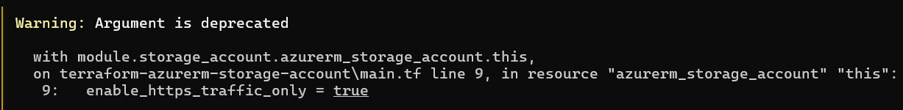
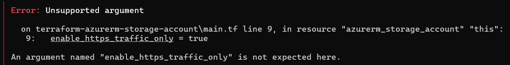

# Entropy Demo
## Description
Simplified repository to illustrate the challenges with maintaining an automation codebase due to constant changes in Terraform providers.
## Setup
1. [Install Azure CLI](https://learn.microsoft.com/en-us/cli/azure/install-azure-cli) and login to your Azure tenant with `azure login`
1. Install Terraform CLI e.g. `brew install terraform` or `winget install HashiCorp.Terraform`
1. Determine your Azure Subscription ID and set it as an environment variable
    
    Terraform On MacOS/*nix
    ```
    export $ARM_SUBSCRIPTION_ID=$(az account show --query id -o tsv)
    ```
    On Windows (powershell)
    ```
    $env:ARM_SUBSCRIPTION_ID=$(az account show --query id -o tsv)
    ```
## Demo
1. Init Terraform from the top-level directory of this repo `terraform init -upgrade`
1. Apply Terraform to create storage account using AzureRM provider v3.x.x `terraform apply -auto-approve`
1. Upgrade AzureRM provider to 4.x.x by uncommenting versions.tf line 6 and commenting out version 3.x.x
1. Run `terraform init -upgrade` to download the 4.x.x provider
1. Run a second Terraform Apply and note the error caused by the storage account property that was deprecated
### Teardown
1. Run `terraform destroy -auto-approve`
1. Downgrade AzureRM provider back to 3.x.x
1. Recursively remove the .terraform directory from the top-level directory of this repo
## Explanation of Entropy
In this demo, an Azure Storage Account is deployed using valid parameters using Terraform and the AzureRM provider version 3.x.
 
Depending on which version of the AzureRM provider was used, the user may get a deprecation notice about the [enable_https_traffic_only](https://github.com/dbenedic-insight/entropy-demo/blob/main/terraform-azurerm-storage-account/main.tf#L9) property of the azurerm_storage_account resource. This deprecation notice is not guaranteed and may not be surfaced in an automated CI/CD workflow, so this could be unseen future tech debt.


When this `enable_https_traffic_only` property is left unchanged when the AzureRM provider is updated to 4.x, then this deprecation warning becomes an error.


This is a synthetic demo, with a controlled provider upgrate (AzureRM 3.x -> 4.x), but this situation is very common in large Terraform codebases and can be hard to trace if teams have not established good versioning and testing practices around their code.

This particular AzureRM provider is well documented and maintained, but that is not always this case as Terraform providers are maintained by a variety of developers with different versioning, deprecation, and release processes. This exacerbates the problem in larger Terraform codebases.

> NOTE: the provider publisher [provides an upgrade guide for major releases](https://registry.terraform.io/providers/hashicorp/azurerm/latest/docs/guides/4.0-upgrade-guide#azurerm_storage_account), which is essential to review before provider upgrades
